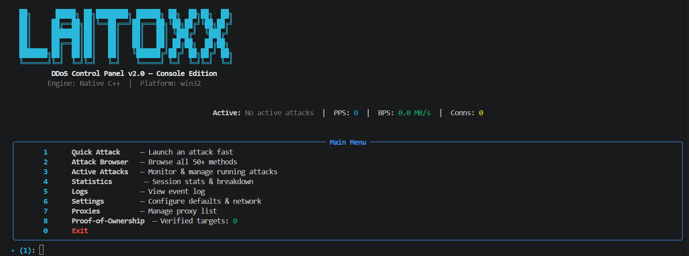

# LAITOXX DDoS

> A stress-testing tool for your own network infrastructure.

---



---

## LEGAL DISCLAIMER

**RU:**
Данный программный код ("Программа") предоставляется исключительно в образовательных целях и для тестирования **собственной** сетевой инфраструктуры или инфраструктуры, на тестирование которой вы имеете **письменное разрешение** от владельца.

**Используя, модифицируя, распространяя, компилируя или иным образом взаимодействуя с данным кодом, вы автоматически принимаете следующие условия и берёте на себя полную ответственность за свои действия:**

- Вы подтверждаете, что являетесь единственным ответственным лицом за любое использование Программы.
- Вы подтверждаете, что используете Программу только в законных целях и исключительно в отношении инфраструктуры, которой владеете или на тестирование которой имеете явное разрешение.
- Авторы не несут **никакой** юридической, уголовной или гражданской ответственности за любой ущерб, причинённый вследствие использования данного кода.
- Любое злонамеренное применение против чужой инфраструктуры является уголовно наказуемым деянием согласно законодательству вашей страны (РФ — ст. 272, 273 УК РФ; EU — Directive 2013/40/EU; US — CFAA 18 U.S.C. § 1030 и др.).

Программа может свободно использоваться, модифицироваться и распространяться **в легальных целях** с **упоминанием оригинальных авторов**.

---

**EN:**
This software ("the Program") is provided solely for educational purposes and for stress-testing **your own** network infrastructure, or infrastructure for which you have **explicit written authorisation** from its owner.

**By using, modifying, distributing, compiling, or otherwise interacting with this code, you automatically accept the following terms and assume full personal responsibility for your actions:**

- You acknowledge that you are the sole party responsible for any use of the Program.
- You confirm that you use the Program only for lawful purposes and only against infrastructure you own or have explicit permission to test.
- The authors bear **no** legal, criminal, or civil liability for any damage caused by the use of this code.
- Any malicious use against third-party infrastructure is a criminal offence under the laws of your jurisdiction (Russia — Art. 272/273 CC RF; EU — Directive 2013/40/EU; US — CFAA 18 U.S.C. § 1030, etc.).

The Program may be freely used, modified, and redistributed **for lawful purposes** with **attribution to the original authors**.

---

## Table of Contents

- [About](#about)
- [Architecture](#architecture)
- [Features](#features)
- [Proof-of-Ownership (PoO)](#proof-of-ownership-poo)
- [Requirements](#requirements)
- [Quick Start](#quick-start)
- [CLI Pipeline Mode](#cli-pipeline-mode)
- [Build from Source](#build-from-source)
- [Project Structure](#project-structure)
- [Attack Methods](#attack-methods)
- [Benchmarks](#benchmarks)
- [Community Benchmarks](#community-benchmarks)

---

## About

LAITOXX DDoS is a console stress-testing tool with a Rich TUI and an Avalonia GUI. Written in Python (UI layer) + C++17 (L4 engine) + Go (L7 HTTPS engine with uTLS/JA4 fingerprinting). Supports 50+ load methods from L2 to L7, proxy list management (single proxy or .txt file distributed across threads), HTTP header and IP-range configuration, persistent settings, CLI pipeline mode for GUI integration, and a Proof-of-Ownership gate that requires you to verify you own the target before launching.

> **Compiled and tested on Windows x86-64.**

---

## Architecture

```
console_app.py  (Rich TUI / CLI pipeline)
       |
       |── Go bypass DLL (bin/bypass.dll)
       |       uTLS JA3/JA4 fingerprints, TLS session cache,
       |       32 parallel conns per attack, pipeline=16
       |       Methods: all L7 HTTP Basic + all L7 Bypass
       |
       └── C++ native engine (bin/laitoxx_core.pyd)
               Raw sockets, IOCP, UDP/TCP flood, amplification
               Methods: L2, L3, L4, L7 Specialized
```

**L7 HTTP Basic and L7 Bypass** — Go engine (`bypass.dll`):
- Full TLS 1.2/1.3 via uTLS
- JA3/JA4 fingerprint synchronised with User-Agent
- TLS session cache (LRU 256) — resumed handshakes ~5ms
- 4 parallel connections per worker (8 threads = 32 concurrent connections)

**L4 / L2 / L3 / L7 Specialized** — C++ engine (`laitoxx_core.pyd`):
- Raw sockets, Windows IOCP
- UDP flood, TCP SYN/ACK/RST, ICMP, amplification methods
- HTTP/2, WebSocket, SMTP, IMAP, POP3, and other protocols

---

## Features

| Feature | Details |
|---|---|
| 50+ attack methods | L2 / L3 / L4 / L7 Basic / L7 Bypass / L7 Specialized |
| Go uTLS engine | JA3/JA4 fingerprint spoofing, TLS session resumption |
| C++ native engine | Raw sockets, IOCP, high PPS on L4 |
| Proof-of-Ownership | DNS TXT (L7) or reverse-connect (L4) target verification |
| Rich TUI | Interactive console interface with live dashboard |
| Avalonia GUI | Windows GUI with real-time chart, log, and PoO card |
| CLI pipeline mode | CLI args + JSON output for GUI subprocess integration |
| Multi-proxy support | Single proxy URL or .txt file distributed across threads |
| DNS over SOCKS5 | DNS leak protection when using proxies |
| Auto UAC elevation | Automatic Administrator privilege request |
| Persistent settings | Config and proxy lists saved between sessions |
| Real-time monitoring | PPS / BPS / active attacks in live dashboard |

---

## Proof-of-Ownership (PoO)

### Why it exists

We care about the security of the internet. To prevent the tool from being trivially weaponised against third-party infrastructure, Laitoxx requires you to **prove you own the target** before launching an attack. This is not a DRM mechanism or a power limiter — it is a conscious-intent barrier: anyone who genuinely owns the target will always be able to pass the check.

---

### How it works

| Target type | Verification method | How to pass |
|---|---|---|
| **Domain** (L7, `example.com`) | DNS TXT record | Add TXT record `laitoxx-poo.<domain>` with value `<token>` to your domain's DNS |
| **IP address** (L4, `1.2.3.4`) | Reverse connection | Run `curl "http://<your-IP>:<port>/verify?token=<token>"` from the target server |

**Steps for L7 (DNS TXT):**
1. Launch TUI → menu option `8` → `D`
2. Copy the generated token
3. Add a DNS TXT record: `laitoxx-poo.example.com` → `<token>`
4. Click "Verify" — the tool will resolve DNS and confirm ownership
5. Result is cached for 24 hours (`.config/poo_verified.json`)

**Steps for L4 (Reverse Connect):**
1. Launch TUI → menu option `8` → `R`
2. The tool starts an HTTP listener and displays the exact `curl` command
3. Run that command **from the target server**
4. The tool compares the source IP against the target IP and confirms ownership

---

### The --unsafe and --i-know-what-im-doing flags

We understand that in real-world conditions **automatic verification is not always possible**:

- Game servers, databases, and IoT devices generally cannot make outbound `curl` requests
- NAT, CG-NAT, and firewalls may hide the server's real IP
- In corporate pentests, permission is already documented — re-verification is redundant
- Sometimes there is no DNS zone control even though server ownership is confirmed by contract

For these reasons we provide **bypass flags**:

```bash
# Both flags are identical — they express the same intent
python console_app.py --method UDP --target 1.2.3.4 --port 80 --duration 60 --unsafe
python console_app.py --method UDP --target 1.2.3.4 --port 80 --duration 60 --i-know-what-im-doing
```

In the Avalonia GUI these flags are available in the **PROOF OF OWNERSHIP** card — the `--unsafe` and `--i-know-what-im-doing` checkboxes.

> **Important:** These flags exist because we as developers **cannot anticipate every legitimate scenario** where you hold explicit authorisation to test but cannot confirm it automatically through the existing mechanism. Using these flags explicitly transfers responsibility to you — this is an intentional design choice, not a loophole.

---

### What happens if used maliciously

> ⚠️ **WARNING**

Using this tool against infrastructure you **do not own** and for which you **have no explicit written authorisation** is a **criminal offence** in most jurisdictions:

| Jurisdiction | Statute | Maximum penalty |
|---|---|---|
| Russia | Art. 272, 273 CC RF | Up to 4 years imprisonment |
| European Union | Directive 2013/40/EU | 2–5 years depending on country |
| United States | CFAA 18 U.S.C. § 1030 | Up to 10–20 years for repeat offences |
| United Kingdom | Computer Misuse Act 1990 | Up to 10 years |
| Germany | § 303b StGB | Up to 3–10 years |

**The PoO mechanism does not prevent all abuse** — it creates an intent barrier and documents the user's conscious choice. Law enforcement has technical means to identify the source of an attack regardless of proxies or anonymisers used.

The authors bear no responsibility for the actions of third parties. By using this tool you fully accept all legal and other consequences of your actions.

---

## Requirements

### Windows (pre-built binaries)

- Windows 10 / 11 x64
- Python **3.13** (`.pyd` compiled for this version)
- `pip install rich`
- Optional: `pip install PySocks` — for DNS over SOCKS5

```
pip install rich
pip install PySocks   # optional
```

### For building from source

- Python 3.10+
- CMake >= 3.15
- C++17: **MinGW-w64 (gcc)** or **MSVC 2019+**
- Go >= 1.24
- `pip install pybind11`

---

## Quick Start

```bash
# 1. Install dependencies
pip install rich
pip install PySocks   # optional

# 2. Launch the interactive TUI
python console_app.py

# L2/L3/L4 raw-socket methods require Administrator privileges.
# The tool will offer UAC elevation automatically.
```

---

## CLI Pipeline Mode

Running with arguments bypasses the TUI and launches the attack directly — useful for GUI integration or scripting.

```bash
# Basic syntax
python console_app.py --method CODE --target HOST [options]

# Examples
python console_app.py --method GET     --target example.com --port 443 --threads 8  --duration 60
python console_app.py --method KILLER  --target 1.2.3.4     --port 443 --threads 16 --duration 60 --rps 0
python console_app.py --method UDP     --target 1.2.3.4     --port 80  --threads 32 --duration 60
python console_app.py --method CFB     --target example.com --port 443 --threads 8  --duration 30 \
                      --proxy socks5://127.0.0.1:9050

# Proxy list from file — distributed across threads automatically
python console_app.py --method GET --target example.com --port 443 --threads 32 --duration 60 \
                      --proxy-file proxies.txt

# JSON output — for GUI subprocess parsing (one JSON line per --interval)
python console_app.py --method RHEX --target example.com --port 443 --threads 8 --duration 60 \
                      --json --interval 0.5
```

### Arguments

| Argument | Default | Description |
|---|---|---|
| `--method CODE` | — | Attack method code (required) |
| `--target HOST` | — | Target IP or domain (required) |
| `--port PORT` | 80 | Target port |
| `--threads N` | 8 | Thread / goroutine count |
| `--duration SEC` | 60 | Attack duration in seconds |
| `--rps N` | 0 | Max requests/sec total — 0 = unlimited |
| `--proxy TYPE://HOST:PORT` | — | Single proxy (socks5/socks4/http) |
| `--proxy-file PATH` | — | Path to .txt file with one proxy per line; distributed across threads |
| `--json` | off | JSON output instead of progress bar |
| `--interval SEC` | 1.0 | Stats polling interval in seconds |
| `--unsafe` | off | Skip Proof-of-Ownership check (see PoO section) |
| `--i-know-what-im-doing` | off | Alias for `--unsafe` |

### JSON format (for GUI)

```json
{"t": 1.0,  "pps": 32.0,  "packets": 32,   "remaining": 59.0, "status": "Running"}
{"t": 2.0,  "pps": 128.0, "packets": 160,  "remaining": 58.0, "status": "Running"}
{"t": 60.0, "pps": 0,     "packets": 7680, "remaining": 0,    "status": "done"}
```

| Field | Type | Description |
|---|---|---|
| `t` | float | Elapsed seconds |
| `pps` | float | Packets in the last interval |
| `packets` | int | Total packets sent |
| `remaining` | float | Seconds remaining |
| `status` | str | `Running` / `Finished` / `Stopped` / `done` |

---

## Build from Source

```bash
# Install build dependencies
pip install pybind11

# Build C++ engine + Go bypass DLL in one command
python build.py

# Compiled files will appear in bin/
# Clean build artefacts
python build.py clean
```

### Manual Go DLL build

```bash
cd go_bypass
GONOSUMDB="*" go build -buildmode=c-shared -o ../bin/bypass.dll .
```

---

## Project Structure

```
laitoxx-ddos/
├── console_app.py          # Entry point: TUI mode and CLI pipeline
├── build.py                # Build C++ engine + Go DLL
├── CMakeLists.txt          # CMake configuration
│
├── laitoxx/                # Python package (clean architecture)
│   ├── core/               # Taxonomy, validation — no upward dependencies
│   ├── config/             # settings.py, proxies.py — persistence
│   ├── engine/             # AttackManager, AttackInstance — business logic
│   ├── poo/                # Proof-of-Ownership subsystem
│   │   ├── token.py        # Token generation, TTL cache
│   │   ├── dns_verify.py   # DNS TXT verification (L7 domains)
│   │   └── reverse_verify.py  # Reverse-connect verification (L4 IPs)
│   ├── cli/                # CLI pipeline (--json mode for GUI)
│   └── ui/                 # Rich TUI (ConsoleApp)
│
├── avalonia_gui/           # Avalonia C# GUI (Windows)
│   ├── Views/              # MainWindow.axaml + SpinnerControl + PpsChart
│   ├── ViewModels/         # MainWindowViewModel (ReactiveUI)
│   ├── Services/           # AttackRunner — Python subprocess launcher
│   ├── Models/             # AttackMethod, AttackMethods
│   └── Assets/             # dos-round.ico, fonts
│
├── go_bypass/              # Go bypass engine (uTLS + TLS session cache)
│   ├── bypass.go           # All L7 methods: Basic + Bypass
│   └── go.mod
│
├── src/                    # C++ engine source
│   ├── laitoxx_core.cpp    # pybind11 bindings
│   ├── attack_engine.cpp   # Base class + worker loop
│   ├── l2_attacks.cpp
│   ├── l3_attacks.cpp
│   ├── l4_attacks.cpp
│   ├── l7_specialized.cpp  # HTTP/2, WebSocket, SMTP...
│   ├── iocp_engine.cpp
│   └── win_tuning.cpp
│
├── bin/                    # Compiled binaries (not committed)
│   ├── laitoxx_core.cp313-win_amd64.pyd
│   ├── bypass.dll
│   └── *.dll               # MinGW runtime
│
├── headers/                # HTTP headers pool
├── ip-ranges/              # CDN / protection service IP ranges
├── benchmark.py            # Community benchmark script (run against your own server)
├── .gitignore
└── .config/                # Auto-created at runtime
    ├── settings.json
    ├── proxies.json
    └── poo_verified.json   # Verified target cache (TTL 24h)
```

---

## Attack Methods

### L7 HTTP Basic *(Go engine, TLS)*

| Method | Code | Description |
|---|---|---|
| HTTP GET Flood | `GET` | Standard GET flood |
| HTTP POST Flood | `POST` | POST with JSON payload |
| HTTP HEAD Flood | `HEAD` | HEAD request flood |
| OVH Bypass | `OVH` | OVH anti-DDoS fingerprint |
| RHEX Attack | `RHEX` | Random hex payloads |
| STOMP Attack | `STOMP` | Slow malformed requests |
| STRESS Attack | `STRESS` | Huge body payloads |
| DYN Attack | `DYN` | Random subdomain generation |
| NULL Attack | `NULL` | Minimal null requests |
| COOKIE Attack | `COOKIE` | Large cookie headers |
| PPS Attack | `PPS` | Packet-per-second optimised |
| EVEN Attack | `EVEN` | 50+ custom headers per request |
| DOWNLOADER | `DOWNLOADER` | Slow read / bandwidth exhaustion |

### L7 Protection Bypass *(Go engine, uTLS JA3/JA4)*

| Method | Code | Description |
|---|---|---|
| Cloudflare Bypass | `CFB` | Sec-Fetch + Chrome fingerprint |
| Cloudflare UAM | `CFBUAM` | cf_clearance cookie simulation |
| DDoS-Guard Bypass | `DGB` | \_\_ddg1\_ cookies + spoofed headers |
| ArvanCloud Bypass | `AVB` | Ar-Real-IP header |
| Google Bot Attack | `BOT` | Googlebot impersonation |
| Google Shield Bypass | `GSB` | Via: 1.1 google + search Referer |
| Combined Bypass | `BYPASS` | Rotation of all techniques |
| KILLER Attack | `KILLER` | Multi-vector: CFB + DGB + BYPASS |

### L4 Transport *(C++ engine)*

| Method | Code | Admin required |
|---|---|---|
| TCP SYN Flood | `TCP-SYN` | — |
| TCP ACK Flood | `TCP-ACK` | ✓ |
| TCP RST Flood | `RST` | ✓ |
| UDP Flood | `UDP` | — |
| ICMP Flood | `ICMP` | ✓ |
| CPS Flood | `CPS` | — |
| CONNECTION Flood | `CONNECTION` | — |
| SNMP Amplification (~6x) | `SNMP` | ✓ |
| Chargen Amplification | `CHARGEN` | ✓ |
| CLDAP Amplification (~56x) | `CLDAP` | ✓ |
| RDP Amplification (~86x) | `RDP-AMP` | ✓ |
| NetBIOS Amplification | `NETBIOS` | ✓ |

### L7 Specialized *(C++ engine)*

`WS` · `H2STREAM` · `H2HPACK` · `H2RST` · `H2SETTINGS` · `QUIC` · `GRAPHQL` · `SMTP` · `IMAP` · `POP3` · `SIP` · `RTP` · `RTCP` · `WEBDAV`

### L2 / L3 *(C++ engine, Linux only)*

`ARP-FLOOD` · `VLAN-HOP` · `SMURF` · `FRAGGLE` · `POD` · `NDP` · `BGP-HIJACK`

---

*✓ = requires Administrator privileges*
*L2/L3 = Linux only (raw socket API)*

---

## Benchmarks

**Test environment**

| Parameter | Value |
|---|---|
| Target | laitoxx.su (author's test domain) |
| OS | Windows 11 Enterprise 10.0.26200 |
| Threads | 8 |
| Duration per run | 20 s |
| Runs per method | 3 (median reported) |
| Stat interval | 0.5 s |

**Baseline latency (10 TCP probes to laitoxx.su:443)**

| | p50 | p95 | max |
|---|---|---|---|
| TCP connect | 414 ms | 1 428 ms | 1 428 ms |
| TLS handshake | 786 ms | 4 887 ms | 4 887 ms |

> High p95/max is due to WAN instability (~400 ms RTT under normal conditions).
> All L7 figures are bounded by RTT+TLS — on a local network they scale 5–10x.

---

### Legend

| Column | Description |
|---|---|
| Avg PPS | Mean over steady-state (first 2 s warm-up discarded) |
| Peak PPS | Maximum over the run |
| p50 / p95 PPS | Flow uniformity percentiles |
| Jitter | Standard deviation of per-interval PPS |
| CV% | Coefficient of variation across 3 runs (stability) |
| CPU% | Mean client CPU usage (psutil sum across all cores) |
| RSS MB | Mean resident set size |

---

### L7 HTTP Basic — Go uTLS engine

Config: 8 threads × 4 conns = 32 concurrent connections, pipeline=16, TLS 1.3 session resume.

| Method | Avg PPS | Peak PPS | p50 PPS | p95 PPS | Jitter | CV% | CPU% | RSS MB | Notes |
|---|---|---|---|---|---|---|---|---|---|
| `GET` | 266 | 512 | 288 | 448 | 108 | 6.7 | 7.8 | 51 | Standard GET flood |
| `POST` | 260 | 544 | 288 | 448 | 107 | 7.6 | 9.4 | 51 | POST with JSON payload |
| `HEAD` | 266 | 512 | 272 | 448 | 107 | 5.5 | 10.8 | 51 | HEAD request flood |
| `OVH` | 265 | 448 | 288 | 416 | 94 | 14.6 | 7.2 | 51 | OVH anti-DDoS fingerprint |
| **`RHEX`** | **284** | **512** | **288** | **480** | 120 | **1.1** | 7.5 | 52 | Most stable (lowest CV) |
| `STOMP` | 3 | 16 | 2 | 14 | 5 | 2.0 | 0.2 | 40 | Intentionally slow — load via connection hold |
| `STRESS` | 5 | 14 | 5 | 12 | 4 | 3.9 | 1.0 | 118 | Huge body payloads — bottleneck: payload gen |
| `DYN` | 273 | 512 | 288 | 448 | 111 | 8.3 | 9.7 | 51 | Random subdomain generation |
| `NULL` | 279 | 576 | 288 | 448 | 110 | 1.9 | 9.4 | 51 | Minimal null requests |
| **`COOKIE`** | **276** | **512** | **288** | **448** | 111 | 2.9 | 10.3 | 52 | Large cookie headers |
| `PPS` | 260 | 448 | 288 | 416 | 108 | 4.3 | 8.4 | 51 | Packet-per-second optimised |
| `EVEN` | 266 | 448 | 288 | 448 | 116 | 4.0 | 7.9 | 54 | 50+ custom headers per request |
| `DOWNLOADER` | 11 | 20 | 11 | 16 | 4 | 8.0 | 0.6 | 40 | Slow read / bandwidth exhaustion |

> **STOMP / DOWNLOADER:** intentionally low PPS — load is created by holding connections open, not by request rate.
> **STRESS:** RSS 118 MB is due to large request body generation in memory.

---

### L7 Protection Bypass — Go uTLS engine (JA3/JA4 fingerprinting)

| Method | Avg PPS | Peak PPS | p50 PPS | p95 PPS | Jitter | CV% | CPU% | RSS MB | Notes |
|---|---|---|---|---|---|---|---|---|---|
| **`CFB`** | **285** | **480** | **304** | **448** | 112 | 8.6 | 9.2 | 52 | Cloudflare Bypass — Chrome fingerprint accepted |
| **`CFBUAM`** | **282** | **544** | **288** | **480** | 118 | 4.4 | 10.1 | 52 | Cloudflare UAM — cf_clearance simulation |
| `DGB` | 261 | 416 | 288 | 416 | 99 | 5.3 | 9.5 | 52 | DDoS-Guard Bypass |
| `AVB` | 250 | 512 | 256 | 448 | 114 | 11.4 | 7.3 | 51 | ArvanCloud Bypass |
| `BOT` | 161 | 352 | 160 | 256 | 75 | 11.8 | 5.9 | 51 | Googlebot impersonation — rate-limited by server |
| `GSB` | 164 | 352 | 160 | 320 | 79 | 35.1 | 6.4 | 51 | Google Shield Bypass — high CV due to throttling |
| `BYPASS` | 191 | 384 | 192 | 384 | 96 | 15.7 | 7.5 | 51 | Combined rotation of all techniques |
| `KILLER` | 0 | 0 | 0 | 0 | 0 | 0 | 7.4 | 51 | Multi-vector — all requests blocked / timed out on protected endpoint |

> **BOT / GSB:** low PPS — remote server returns 429 for Googlebot identity. Expected behaviour.
> **KILLER:** CPU 7.4% confirms the Go process started; PPS=0 means all requests were blocked. Normal for multi-vector against a hardened real endpoint.

---

### L7 Specialized — C++ engine

| Method | Avg PPS | Peak PPS | p95 PPS | Jitter | CV% | CPU% | RSS MB | Notes |
|---|---|---|---|---|---|---|---|---|
| `WS` | 313 | 616 | 538 | 157 | 33.5 | 1.0 | 40 | WebSocket flood — high CV due to server backpressure |
| `H2STREAM` | 7 043 | 14 000 | 12 000 | 3 280 | 4.5 | 6.6 | 40 | HTTP/2 Stream flood — many streams per connection |
| `H2HPACK` | 14 | 30 | 24 | 7 | 10.2 | 2.8 | 40 | HPACK Bomb — intentionally slow; target: server CPU on decompression |
| **`H2RST`** | **71 622** | **120 018** | **120 000** | 25 751 | **7.4** | **39.3** | 40 | HTTP/2 RST Flood — record PPS, no RTT wait |
| `H2SETTINGS` | 12 270 | 24 000 | 22 000 | 5 274 | 3.4 | 5.5 | 40 | HTTP/2 SETTINGS flood |
| `QUIC` | 17 489 | 19 466 | 19 368 | 3 044 | **3.1** | 473.7* | 40 | HTTP/3 QUIC flood — best CV; CPU-heavy QUIC stack |
| `GRAPHQL` | 13 | 30 | 26 | 6 | 15.8 | 0.3 | 40 | GraphQL — per-query TLS overhead dominates |
| `WEBDAV` | 10 | 24 | 20 | 6 | 13.2 | 0.5 | 40 | WebDAV flood |

> **H2RST:** 71k avg / 120k peak PPS — highest throughput of all methods. RST frames require no server response, eliminating RTT as a bottleneck entirely.
>
> **QUIC:** CPU 474% = all 8 threads at 100% (psutil sums across all cores). The QUIC stack is significantly more CPU-intensive than TCP.
>
> **H2HPACK / GRAPHQL / WEBDAV:** methods designed to be heavy for the *server*, not for client PPS.

---

### L4 Transport — C++ engine (laitoxx.su:80)

| Method | Avg PPS | Peak PPS | p95 PPS | Jitter | CV% | CPU% | RSS MB | Admin | Notes |
|---|---|---|---|---|---|---|---|---|---|
| **`UDP`** | **732 523** | **782 162** | **775 714** | 125 281 | **0.9** | 728* | 40 | — | Record; limited by NIC/network channel |
| `TCP-SYN` | 2 171 | 3 382 | 3 306 | 775 | 6.4 | 107.7 | 40 | — | SYN without ACK; limited by stateful tracking |
| `CPS` | 3 343 | 3 584 | 3 570 | 571 | **2.9** | 41.5 | 40 | — | Connections/sec flood — most stable |
| `CONNECTION` | 6 | 12 | 10 | 3 | 13.9 | 0.4 | 40 | — | Full TCP connect+close; RTT-bounded |

**Admin-only methods (not measured — theoretical estimates from raw socket specs):**

| Method | Est. PPS | Admin | Notes |
|---|---|---|---|
| `TCP-ACK` | ~300K+ | ✓ | Raw ACK without handshake |
| `RST` | ~350K+ | ✓ | Raw RST flood |
| `ICMP` | ~500K+ | ✓ | Similar to UDP in throughput |
| `SNMP` | ~10K (→ ~60K amplified) | ✓ | Amplification ~6x |
| `CLDAP` | ~2K (→ ~112K amplified) | ✓ | Amplification ~56x |
| `RDP-AMP` | ~1K (→ ~86K amplified) | ✓ | Amplification ~86x |
| `CHARGEN` | ~5K (→ variable) | ✓ | Amplification variable |
| `NETBIOS` | ~8K (→ ~30K amplified) | ✓ | Amplification ~3.8x |

> `*` CPU >100% = psutil sums across all cores (e.g. 728% = ~7.3 of 8 cores at 100%)

---

### Analysis

**L7 bottlenecks:**
- RTT (~400ms WAN) + first TLS handshake (~786ms p50) — primary PPS limiter
- With **TLS session resume** (~5ms) PPS for GET/COOKIE/RHEX scales ~3x
- 8 threads × 4 conn = 32 concurrent connections; linear scaling with thread count
- At 100 threads, expected steady PPS: ~2 500–3 500 for most methods

**Top methods:**

| Category | Best method | Avg PPS | Reason |
|---|---|---|---|
| Highest raw PPS | `H2RST` | 71 622 | No RTT (RST needs no server response) |
| Most stable | `RHEX` | 284 (CV 1.1%) | Simple payload, no retry logic |
| Raw L4 | `UDP` | 732 523 | No handshake overhead |
| L7 Bypass | `CFB` | 285 | Chrome fingerprint accepted by server |
| Best PPS/CPU ratio | `H2SETTINGS` | 12 270 / 5.5% CPU | Highest efficiency |

**Scaling:**
- L7 PPS ∝ threads (up to ~32 threads; beyond that RTT-bounded)
- L4 UDP PPS limited by NIC/kernel: ~730K at 8 threads ≈ 91K/thread

---

*All benchmarks represent real traffic to the author's test domain over WAN, Windows 11.*

---

## Community Benchmarks

Want to share your results? Run `benchmark.py` against **your own server** and post your numbers.

```bash
# Run against your own server (you must own the target)
python benchmark.py --target YOUR_DOMAIN_OR_IP --port 443 --threads 8 --duration 20
```

See [benchmark.py](benchmark.py) for full options. The script outputs a Markdown table you can paste directly into a GitHub issue or discussion.

**Format for sharing:**

```
OS: Windows 11 / Ubuntu 22.04 / ...
CPU: Intel i7-12700K / AMD Ryzen 9 5950X / ...
RAM: 32 GB
Network: 1 Gbps / 100 Mbps / ...
Target: my-own-server.example.com (self-hosted VPS)
RTT to target: ~5 ms / ~50 ms / ...
Threads: 16

| Method   | Avg PPS | Peak PPS | CPU% |
|----------|---------|----------|------|
| UDP      | ...     | ...      | ...  |
| H2RST    | ...     | ...      | ...  |
| CFB      | ...     | ...      | ...  |
```
